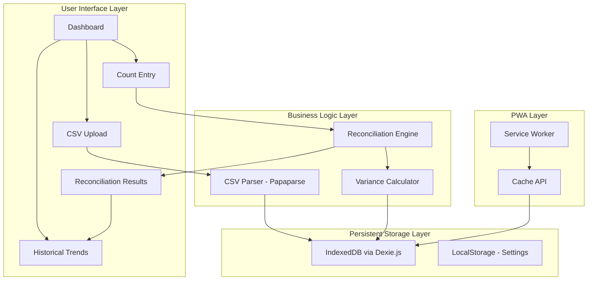

# LPG Stock Reconciliation System - Implementation Plan

## Architecture Overview



## Tech Stack

| Component | Technology | Purpose ||-----------|------------|---------|| Framework | React 18 + Vite | Fast builds, modern DX || Styling | Tailwind CSS | Dark theme, responsive design || Forms | React Hook Form | Efficient form handling || Charts | Recharts | Variance trend visualizations || CSV Parsing | Papaparse | Robust CSV handling || Storage | Dexie.js (IndexedDB) | Persistent offline storage || PWA | Vite PWA Plugin | Service worker, offline capability || Icons | Lucide React | Modern icon set || Date Handling | date-fns | Lightweight date utilities |

## Project Structure

```javascript
src/
├── components/
│   ├── layout/
│   │   ├── Header.tsx
│   │   ├── Navigation.tsx
│   │   └── Layout.tsx
│   ├── dashboard/
│   │   ├── Dashboard.tsx
│   │   ├── SummaryCards.tsx
│   │   └── RecentCounts.tsx
│   ├── csv/
│   │   ├── CSVUpload.tsx
│   │   └── CSVPreview.tsx
│   ├── count/
│   │   ├── CountSession.tsx
│   │   ├── FullsEntry.tsx        # Entry by content SKU (9.3, 9.4, 901...)
│   │   ├── EmptiesEntry.tsx      # Entry by size with brand breakdown
│   │   └── CountProgress.tsx
│   ├── reconciliation/
│   │   ├── ReconciliationResults.tsx
│   │   ├── DepositVarianceTable.tsx   # Shell reconciliation
│   │   ├── ContentVarianceTable.tsx   # Gas content reconciliation
│   │   └── VarianceAlert.tsx
│   └── trends/
│       ├── TrendsDashboard.tsx
│       ├── VarianceChart.tsx
│       └── FilterControls.tsx
├── hooks/
│   ├── useDatabase.ts
│   ├── useReconciliation.ts
│   └── useExport.ts
├── lib/
│   ├── db.ts                     # Dexie schema with dual data model
│   ├── csvParser.ts
│   ├── skuConfig.ts              # SKU mappings (size, brand, deposit)
│   ├── depositReconciliation.ts  # Shell variance calculations
│   ├── contentReconciliation.ts  # Gas content variance calculations
│   └── exportUtils.ts
├── types/
│   └── index.ts
└── App.tsx
```

## Data Model (IndexedDB Schema)

```typescript
// ERP Snapshots
interface ERPSnapshot {
  id: string;
  timestamp: Date;
  exportTime: Date;
  data: ERPItem[];
}

// ERP Item (parsed from CSV)
interface ERPItem {
  sku: string;           // "9.1", "9.3", "9.4", "901", etc.
  category: string;      // "D" (deposit) or "C" (content)
  group: string;         // Size grouping
  description: string;
  uom: string;
  quantity: number;      // CALC. ON HAND value
}

// Count Sessions
interface CountSession {
  id: string;
  timestamp: Date;
  sessionType: 'AM' | 'PM' | 'EOD';
  erpSnapshotId: string;
  physicalCounts: PhysicalCounts;
  reconciliation: ReconciliationResult;
  counterName?: string;
  notes?: string;
  status: 'in_progress' | 'completed';
}

// Physical Counts - DUAL STRUCTURE
interface PhysicalCounts {
  // Full cylinders by CONTENT SKU (tracks gas inventory)
  fullsByContent: Record<string, number>;
  // Example: { "9.3": 1, "9.4": 30, "901": 316, "14.3": 14, "14.4": 32 }

  // Empty cylinders by SIZE with REQUIRED brand breakdown
  emptiesBySize: {
    [size: string]: {
      oryx: number;
      easigas: number;
      generic: number;
      total: number;  // Auto-calculated: oryx + easigas + generic
    };
  };
  // Example: { "9kg": { oryx: 20, easigas: 15, generic: 18, total: 53 } }
}

// Reconciliation Result - DUAL RECONCILIATION
interface ReconciliationResult {
  // DEPOSIT RECONCILIATION (Shell/Asset tracking)
  depositReconciliation: Array<{
    size: string;           // "9kg", "14kg", "19kg", "SV", "DV"
    depositSku: string;     // "9.1", "14.1", "19.1", "S.1", "D.1"
    systemShells: number;   // From ERP deposit SKU
    physicalFulls: number;  // Sum of all content SKUs for this size
    physicalEmpties: number;// Empty count for this size
    physicalTotal: number;  // physicalFulls + physicalEmpties
    variance: number;       // systemShells - physicalTotal
    status: 'ok' | 'warning' | 'critical';
  }>;

  // CONTENT RECONCILIATION (Gas inventory tracking)
  contentReconciliation: Array<{
    sku: string;            // "9.3", "9.4", "901", etc.
    description: string;
    brand: 'Oryx' | 'Easigas' | 'Generic';
    size: string;           // "9kg", "14kg", etc.
    systemQuantity: number; // From ERP content SKU
    physicalQuantity: number;// From physical count
    variance: number;       // systemQuantity - physicalQuantity
    status: 'ok' | 'warning' | 'critical';
  }>;

  // Summary stats
  totalDepositVariance: number;
  totalContentVariance: number;
  criticalCount: number;
  warningCount: number;
}

// SKU Mapping Configuration
const SKU_CONFIG = {
  sizes: ['9kg', '14kg', '19kg', 'SV', 'DV'],
  depositSkus: {
    '9kg': '9.1',
    '14kg': '14.1',
    '19kg': '19.1',
    'SV': 'S.1',
    'DV': 'D.1'
  },
  contentSkuToSize: {
    '9.3': '9kg', '9.4': '9kg', '901': '9kg',
    '14.3': '14kg', '14.4': '14kg', '1401': '14kg',
    '19.3': '19kg', '19.4': '19kg', '1901': '19kg',
    'S.3': 'SV', 'S.4': 'SV', 'S01': 'SV',
    'D.3': 'DV', 'D.4': 'DV', 'D01': 'DV'
  },
  contentSkuToBrand: {
    '9.3': 'Easigas', '9.4': 'Oryx', '901': 'Generic',
    '14.3': 'Easigas', '14.4': 'Oryx', '1401': 'Generic',
    '19.3': 'Easigas', '19.4': 'Oryx', '1901': 'Generic',
    'S.3': 'Easigas', 'S.4': 'Oryx', 'S01': 'Generic',
    'D.3': 'Easigas', 'D.4': 'Oryx', 'D01': 'Generic'
  }
};
```

## UI Design Specifications (Modern Dark Theme)

| Element | Color ||---------|-------|| Background | `#0f0f0f` (near black) || Surface | `#1a1a1a` (cards/panels) || Surface Elevated | `#252525` (inputs/hover) || Primary Accent | `#3b82f6` (blue-500) || Success | `#22c55e` (green-500) || Warning | `#f59e0b` (amber-500) || Critical | `#ef4444` (red-500) || Text Primary | `#f5f5f5` || Text Secondary | `#a3a3a3` || Border | `#333333` |

## Key Implementation Details

### 1. CSV Parser Configuration

- Auto-detect headers from your ERP format
- Map columns: ITEM NUMBER, CAT, GROUP, DESCRIPTION, UOM, CALC. ON HAND
- Validate required fields before import
- Support drag-drop and paste

### 2. Dual Reconciliation Engine Logic

**DEPOSIT RECONCILIATION (Shell/Asset Tracking)**Tracks total cylinders (physical assets) regardless of whether they contain gas.

```typescript
function reconcileDeposits(physical: PhysicalCounts, erp: ERPSnapshot) {
  // For each size (9kg, 14kg, 19kg, SV, DV):
  return sizes.map(size => {
    // Step 1: Sum ALL full cylinders of this size (across all brands)
    const physicalFulls = Object.entries(physical.fullsByContent)
      .filter(([sku]) => SKU_CONFIG.contentSkuToSize[sku] === size)
      .reduce((sum, [, count]) => sum + count, 0);
    
    // Step 2: Get empty cylinder count for this size
    const physicalEmpties = physical.emptiesBySize[size]?.total || 0;
    
    // Step 3: Total physical shells
    const physicalTotal = physicalFulls + physicalEmpties;
    
    // Step 4: Get system count from deposit SKU (e.g., "9.1")
    const depositSku = SKU_CONFIG.depositSkus[size];
    const systemShells = erp.data.find(i => i.sku === depositSku)?.quantity || 0;
    
    // Step 5: Calculate variance
    const variance = systemShells - physicalTotal;
    
    return { size, depositSku, systemShells, physicalFulls, 
             physicalEmpties, physicalTotal, variance };
  });
}

// Example calculation for 9kg:
// physicalFulls = 9.3(1) + 9.4(30) + 901(316) = 347
// physicalEmpties = 53
// physicalTotal = 400
// systemShells (9.1) = 245
// variance = 245 - 400 = -155 (system shows 155 fewer shells)
```

**CONTENT RECONCILIATION (Gas Inventory Tracking)**Tracks gas content in full cylinders only, by specific SKU/brand.

```typescript
function reconcileContents(physical: PhysicalCounts, erp: ERPSnapshot) {
  // For each content SKU entered in physical count:
  return Object.entries(physical.fullsByContent).map(([sku, physicalQty]) => {
    // Get system quantity for this content SKU
    const erpItem = erp.data.find(i => i.sku === sku);
    const systemQty = erpItem?.quantity || 0;
    
    // Calculate variance
    const variance = systemQty - physicalQty;
    
    return {
      sku,
      description: erpItem?.description || '',
      brand: SKU_CONFIG.contentSkuToBrand[sku],
      size: SKU_CONFIG.contentSkuToSize[sku],
      systemQuantity: systemQty,
      physicalQuantity: physicalQty,
      variance
    };
  });
}

// Example calculation for 9.4 (Oryx 9kg Full):
// physicalQuantity = 30 (from physical count)
// systemQuantity = 32 (from ERP)
// variance = 32 - 30 = +2 (system shows 2 more than physical)
```

**Variance Status Thresholds**

```typescript
function getVarianceStatus(variance: number): 'ok' | 'warning' | 'critical' {
  const absVariance = Math.abs(variance);
  if (absVariance === 0) return 'ok';
  if (absVariance <= 10) return 'warning';
  return 'critical';  // Any variance > 10 is critical
}
```

### 3. Offline Strategy

- Service worker caches app shell and assets
- IndexedDB stores all count data locally
- Sync indicator shows offline/online status
- All operations work without network

### 4. Export Functionality

- CSV export for variance reports
- PDF export using browser print-to-PDF
- Include date range filtering
- Export single session or date range

## Implementation Phases

### Phase 1: Foundation (Core Setup)

- Initialize Vite + React + TypeScript project
- Configure Tailwind with dark theme
- Set up Dexie.js database schema with dual reconciliation model
- Create SKU configuration mapping (size, brand, deposit SKUs)
- Create base layout components

### Phase 2: Data Import

- Build CSV upload component with drag-drop
- Implement Papaparse integration
- Parse and categorize SKUs (deposit vs content)
- Create ERP data preview and validation
- Store snapshots in IndexedDB

### Phase 3: Count Entry - Fulls

- Build Fulls entry form organized by SIZE then BRAND
- Display ERP reference values alongside input fields
- Group: 9kg (Easigas 9.3, Oryx 9.4, Generic 901), 14kg, 19kg, SV, DV
- Auto-save on field change
- Progress indicator

### Phase 4: Count Entry - Empties

- Build Empties entry form by SIZE with REQUIRED brand breakdown
- For each size (9kg, 14kg, 19kg, SV, DV):
- Oryx count input
- Easigas count input
- Generic count input
- Auto-calculated total
- Auto-save on field change

### Phase 5: Dual Reconciliation Engine

- Implement Deposit Reconciliation (shell tracking):
- Sum fulls by size + empties by size = physical shells
- Compare to deposit SKU from ERP
- Implement Content Reconciliation (gas tracking):
- Compare each content SKU physical vs ERP
- Apply variance status thresholds

### Phase 6: Results Display

- Build dual results view with clear separation:
- DEPOSIT table (shells by size)
- CONTENT table (gas by SKU)
- Color-coded variance indicators (ok/warning/critical)
- Summary cards with totals
- Notes/investigation field

### Phase 7: Historical Tracking

- Build trends dashboard
- Implement Recharts visualizations
- Filter by reconciliation type (deposit vs content)
- Add date range and SKU filters
- Create comparison views (AM vs PM vs EOD)

### Phase 8: PWA and Export

- Configure Vite PWA plugin
- Implement service worker
- Add offline indicator
- Build CSV/PDF export with both reconciliation types

## UI Screen Mockups

### Fulls Entry Screen

```javascript
SECTION 1: FULL CYLINDERS (by Content SKU)
------------------------------------------
9kg FULLS:
  Easigas (9.3)  [____]  ERP: 32
  Oryx (9.4)     [____]  ERP: 20
  Generic (901)  [____]  ERP: 316

14kg FULLS:
  Easigas (14.3) [____]  ERP: 14
  Oryx (14.4)    [____]  ERP: 32
  Generic (1401) [____]  ERP: 0
...
```

### Empties Entry Screen

```javascript
SECTION 2: EMPTY CYLINDERS (by Size + Brand)
--------------------------------------------
9kg EMPTIES:
  Oryx     [____]
  Easigas  [____]
  Generic  [____]
  TOTAL:   53 (auto-calculated)

14kg EMPTIES:
  Oryx     [____]
  Easigas  [____]
  Generic  [____]
  TOTAL:   36 (auto-calculated)
...
```

### Reconciliation Results Screen

```javascript
DEPOSIT RECONCILIATION (SHELLS)
-------------------------------
Size  Deposit SKU  System  Physical  Variance
9kg   9.1          245     400       -155 CRITICAL
14kg  14.1         77      87        -10  WARNING
19kg  19.1         105     136       -31  CRITICAL
...

CONTENT RECONCILIATION (GAS IN FULLS)
-------------------------------------
SKU   Brand     System  Physical  Variance
9.3   Easigas   32      31        +1   OK
9.4   Oryx      20      30        -10  WARNING
901   Generic   316     316       0    OK
...
```

## Deliverables

1. Fully functional React PWA with dual reconciliation
2. Mobile-optimized count entry with brand breakdown