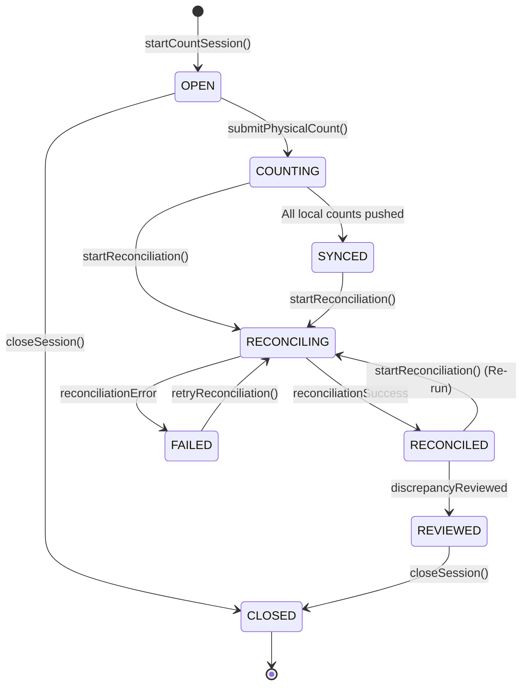

# LPG Stock Recon — State Machine Specification

This document defines the lifecycle states and transitions for the core entities in the LPG Stock Recon system.

---

## 1. Session Lifecycle State Machine

### Transition Table (Hard Enforcement)

| From State | Allowed To States | Triggering Action |
|---|---|---|
| **OPEN** | **COUNTING**, **CLOSED** | `submitPhysicalCount()`, `closeSession()` |
| **COUNTING** | **SYNCED**, **RECONCILING** | (Client Sync), `startReconciliation()` |
| **SYNCED** | **RECONCILING** | `startReconciliation()` |
| **RECONCILING** | **RECONCILED**, **FAILED** | (Internal Process Success/Error) |
| **RECONCILED** | **REVIEWED**, **RECONCILING** | `upsertDiscrepancyNote()`, `startReconciliation()` |
| **REVIEWED** | **CLOSED** | `closeSession()` |
| **FAILED** | **RECONCILING** | `retryReconciliation()` |

---

## 2. Reconciliation Pipeline Stages (Observability)

Within the `RECONCILING` state, the process follows these stages:

1. `VALIDATE_INPUT`
2. `LOAD_ERP_SNAPSHOT`
3. `LOAD_SESSION_COUNTS`
4. `TIER_1_MATCHING`
5. `TIER_2_INFERENCE`
6. `TIER_3_VARIANCE_DETECTION`
7. `GENERATE_REPORT`
8. `COMPLETE`

---

## 3. Discrepancy Sub-States

Notes added during `REVIEWED` follow this logic:
- `OPEN` (Flagged)
- `INVESTIGATING` (Note added)
- `RESOLVED` (Closed out)
- `WRITTEN_OFF` (Loss/Gain accepted)
