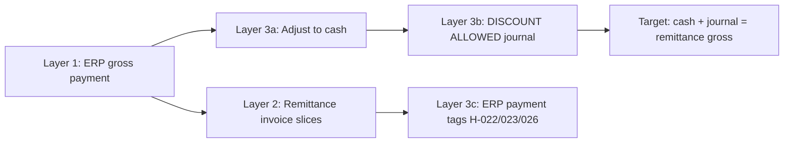

# TWK002 — reconciliation layers (ERP → remittance → correction)

**Purpose:** Visualise the three-step Model B stack you described:

1. **Layer 1 — ERP as-posted** — what the ledger shows today (often gross lump payments, blank INVNO)
2. **Layer 2 — Remittance adjustments** — which invoices each payment actually cleared (Tier-1 authority)
3. **Layer 3 — Corrections** — strip payment to cash, post `DISCOUNT ALLOWED` journal, reverse ghosts; ERP tagging hygiene

**Sources:** `TWK002_FULL_HISTORY.TXT` · `allocation_edges.csv` · `recreated_ledger_payment_bridge_*.csv` · `finance_posting_checklist_2025_phase2.csv`

---

## BATCH-2023-06-26 · STAT:92 · receipt **22182**

### Layer 1 — ERP as-posted

| Date | Doc | Entry | INVNO | Reference | Amount | Issue |
| :--- | :--- | :--- | :--- | :--- | ---: | :--- |
| 03/07/2023 | 22182 | Payment | — | TRANSF / STAT:92 · TWK AGRI | -R46,424.87 | **Untagged** — remittance names targets; ERP INVNO blank |

### Layer 2 — Remittance invoice allocations (Tier-1)

Remittance **cash R45,264.25** decomposed to **5** invoice/CN slices:

| Edge | Invoice | Slice (R) | Type |
| :--- | :--- | ---: | :--- |
| AL-0001 | 19704 | 9,271.37 | REMITTANCE_EXPLICIT |
| AL-0002 | 19706 | 11,077.95 | REMITTANCE_EXPLICIT |
| AL-0003 | 19768 | 10,458.65 | REMITTANCE_EXPLICIT |
| AL-0004 | 19769 | 12,244.05 | REMITTANCE_EXPLICIT |
| AL-0005 | 20606 | 2,212.23 | REMITTANCE_EXPLICIT |

### Layer 3 — Path B corrections & hygiene

| Step | Action | Doc / task | Amount | Status |
| :--- | :--- | :--- | ---: | :--- |
| 3a | Cash already correct | 22182 | -R45,264.25 | PROVEN — no strip needed |
| ✓ | **Target check** | cash + journal | -R46,424.87 gross | remittance gross -R46,424.87 |

---

## BATCH-2023-07-26 · STAT 92 · receipt **23115**

### Layer 1 — ERP as-posted

| Date | Doc | Entry | INVNO | Reference | Amount | Issue |
| :--- | :--- | :--- | :--- | :--- | ---: | :--- |
| 26/07/2023 | 23115 | Payment | — | TRANSF / STAT 92 · TWK AGRI | -R8,145.79 | **Untagged** — remittance names targets; ERP INVNO blank |

### Layer 2 — Remittance invoice allocations (Tier-1)

Remittance **cash R7,942.14** decomposed to **2** invoice/CN slices:

| Edge | Invoice | Slice (R) | Type |
| :--- | :--- | ---: | :--- |
| AL-0006 | 21122 | 3,403.77 | REMITTANCE_EXPLICIT |
| AL-0007 | 21594 | 4,538.37 | REMITTANCE_EXPLICIT |

### Layer 3 — Path B corrections & hygiene

| Step | Action | Doc / task | Amount | Status |
| :--- | :--- | :--- | ---: | :--- |
| 3a | Cash already correct | 23115 | -R7,942.14 | PROVEN — no strip needed |
| ✓ | **Target check** | cash + journal | -R8,145.79 gross | remittance gross -R8,145.79 |

---

## BATCH-2023-08-28 · STAT 93 · receipt **23836**

### Layer 1 — ERP as-posted

| Date | Doc | Entry | INVNO | Reference | Amount | Issue |
| :--- | :--- | :--- | :--- | :--- | ---: | :--- |
| 01/09/2023 | 23836 | Payment | — | TRANSF / STAT 93 · TWK AGRI | -R27,738.41 | **Untagged** — remittance names targets; ERP INVNO blank |

### Layer 2 — Remittance invoice allocations (Tier-1)

Remittance **cash R26,924.19** decomposed to **18** invoice/CN slices:

| Edge | Invoice | Slice (R) | Type |
| :--- | :--- | ---: | :--- |
| AL-0008 | 20607 | 3,450.00 | REMITTANCE_EXPLICIT |
| AL-0009 | 21123 | 5,175.00 | REMITTANCE_EXPLICIT |
| AL-0010 | 21597 | 6,727.50 | REMITTANCE_EXPLICIT |
| AL-0011 | 22058 | 7,063.87 | REMITTANCE_EXPLICIT |
| AL-0012 | 22060 | 6,883.40 | REMITTANCE_EXPLICIT |
| AL-0013 | 22255 | 5,225.02 | REMITTANCE_EXPLICIT |
| AL-0014 | 22268 | 6,727.50 | REMITTANCE_EXPLICIT |
| AL-0018 | 22626 | 8,405.48 | REMITTANCE_EXPLICIT |
| AL-0019 | 22627 | 10,091.25 | REMITTANCE_EXPLICIT |
| AL-0020 | 22702 | 2,158.16 | REMITTANCE_EXPLICIT |
| AL-0021 | 22739 | 1,681.87 | REMITTANCE_EXPLICIT |
| AL-0015 | 5038 | 3,027.37 | REMITTANCE_CN_OFFSET |
| AL-0023 | 5155 | 5,045.62 | REMITTANCE_CN_OFFSET |
| AL-0016 | 5308 | 6,391.12 | REMITTANCE_CN_OFFSET |
| AL-0024 | 5443 | 6,054.75 | REMITTANCE_CN_OFFSET |
| AL-0017 | 5498 | 6,727.50 | REMITTANCE_CN_OFFSET |
| AL-0022 | 5603 | 7,400.25 | REMITTANCE_CN_OFFSET |
| AL-0025 | 5632 | 2,018.25 | REMITTANCE_CN_OFFSET |

### Layer 3 — Path B corrections & hygiene

| Step | Action | Doc / task | Amount | Status |
| :--- | :--- | :--- | ---: | :--- |
| 3a | Cash already correct | 23836 | -R26,924.19 | PROVEN — no strip needed |
| ✓ | **Target check** | cash + journal | -R27,393.41 gross | remittance gross -R27,393.41 |

---

## BATCH-2023-09-26 · STAT 94 · receipt **24560**

### Layer 1 — ERP as-posted

| Date | Doc | Entry | INVNO | Reference | Amount | Issue |
| :--- | :--- | :--- | :--- | :--- | ---: | :--- |
| 26/09/2023 | 24560 | Payment | — | TRANSF / STAT 94 · TWK AGRI | -R14,684.27 | **Untagged** — remittance names targets; ERP INVNO blank |

### Layer 2 — Remittance invoice allocations (Tier-1)

Remittance **cash R14,317.17** decomposed to **9** invoice/CN slices:

| Edge | Invoice | Slice (R) | Type |
| :--- | :--- | ---: | :--- |
| AL-0026 | 23075 | 3,508.84 | REMITTANCE_EXPLICIT |
| AL-0027 | 23077 | 6,727.50 | REMITTANCE_EXPLICIT |
| AL-0029 | 23311 | 6,964.08 | REMITTANCE_EXPLICIT |
| AL-0030 | 23312 | 7,400.25 | REMITTANCE_EXPLICIT |
| AL-0028 | 5768 | 4,709.25 | REMITTANCE_CN_OFFSET |
| AL-0031 | 5845 | 5,045.62 | REMITTANCE_CN_OFFSET |
| AL-0032 | 5845/5875 | 192.24 | REMITTANCE_CN_OFFSET |
| AL-0033 | 5875 | 336.37 | REMITTANCE_CN_OFFSET |
| AL-0034 | STMT-DIFF-AUG23 | 0.02 | REMITTANCE_EXPLICIT |

### Layer 3 — Path B corrections & hygiene

| Step | Action | Doc / task | Amount | Status |
| :--- | :--- | :--- | ---: | :--- |
| 3a | Cash already correct | 24560 | -R14,317.17 | PROVEN — no strip needed |
| ✓ | **Target check** | cash + journal | -R14,684.27 gross | remittance gross -R14,684.27 |

---

## BATCH-2023-10-26 · STAT 95 · receipt **25906**

### Layer 1 — ERP as-posted

| Date | Doc | Entry | INVNO | Reference | Amount | Issue |
| :--- | :--- | :--- | :--- | :--- | ---: | :--- |
| 08/11/2023 | 25906 | Payment | — | TRANSF / STAT 95 · TWK AGRI | -R17,064.38 | **Untagged** — remittance names targets; ERP INVNO blank |

### Layer 2 — Remittance invoice allocations (Tier-1)

Remittance **cash R16,637.78** decomposed to **8** invoice/CN slices:

| Edge | Invoice | Slice (R) | Type |
| :--- | :--- | ---: | :--- |
| AL-0035 | 24011 | 4,955.14 | REMITTANCE_EXPLICIT |
| AL-0036 | 24012 | 10,091.25 | REMITTANCE_EXPLICIT |
| AL-0037 | 24201 | 8,318.89 | REMITTANCE_EXPLICIT |
| AL-0038 | 24202 | 10,091.25 | REMITTANCE_EXPLICIT |
| AL-0039 | 25043 | 10,764.00 | REMITTANCE_EXPLICIT |
| AL-0040 | 6078 | 10,091.25 | REMITTANCE_CN_OFFSET |
| AL-0041 | 6134 | 6,727.50 | REMITTANCE_CN_OFFSET |
| AL-0042 | 6387 | 10,764.00 | REMITTANCE_CN_OFFSET |

### Layer 3 — Path B corrections & hygiene

| Step | Action | Doc / task | Amount | Status |
| :--- | :--- | :--- | ---: | :--- |
| 3a | Cash already correct | 25906 | -R16,637.78 | PROVEN — no strip needed |
| ✓ | **Target check** | cash + journal | -R17,064.38 gross | remittance gross -R17,064.38 |

---

## BATCH-2023-11-27 · STAT 96 · receipt **26681**

### Layer 1 — ERP as-posted

| Date | Doc | Entry | INVNO | Reference | Amount | Issue |
| :--- | :--- | :--- | :--- | :--- | ---: | :--- |
| 29/11/2023 | 26681 | Payment | — | TRANSF / STAT 96 · TWK AGRI | -R31,872.29 | **Untagged** — remittance names targets; ERP INVNO blank |

### Layer 2 — Remittance invoice allocations (Tier-1)

Remittance **cash R30,825.36** decomposed to **9** invoice/CN slices:

| Edge | Invoice | Slice (R) | Type |
| :--- | :--- | ---: | :--- |
| AL-0043 | 24011 | 3,450.00 | REMITTANCE_EXPLICIT |
| AL-0044 | 25042 | 8,122.16 | REMITTANCE_EXPLICIT |
| AL-0045 | 25293 | 7,280.19 | REMITTANCE_EXPLICIT |
| AL-0046 | 25294 | 4,036.50 | REMITTANCE_EXPLICIT |
| AL-0049 | 26027 | 12,982.13 | REMITTANCE_EXPLICIT |
| AL-0050 | 26033 | 13,455.00 | REMITTANCE_EXPLICIT |
| AL-0047 | 6461 | 3,363.75 | REMITTANCE_CN_OFFSET |
| AL-0048 | 6462 | 4,372.87 | REMITTANCE_CN_OFFSET |
| AL-0051 | 6667 | 10,764.00 | REMITTANCE_CN_OFFSET |

### Layer 3 — Path B corrections & hygiene

| Step | Action | Doc / task | Amount | Status |
| :--- | :--- | :--- | ---: | :--- |
| 3a | Cash already correct | 26681 | -R30,825.36 | PROVEN — no strip needed |
| ✓ | **Target check** | cash + journal | -R31,527.29 gross | remittance gross -R31,527.29 |

---

## BATCH-2024-03-26 · STAT 100 · receipt **29684**

### Layer 1 — ERP as-posted

| Date | Doc | Entry | INVNO | Reference | Amount | Issue |
| :--- | :--- | :--- | :--- | :--- | ---: | :--- |
| 27/03/2024 | 29684 | Payment | — | TRANSF / STAT 100 · TWK AGRI | -R77,692.03 | **Untagged** — remittance names targets; ERP INVNO blank |

### Layer 2 — Remittance invoice allocations (Tier-1)

Remittance **cash R73,610.18** decomposed to **18** invoice/CN slices:

| Edge | Invoice | Slice (R) | Type |
| :--- | :--- | ---: | :--- |
| AL-0052 | 23075 | 345.00 | REMITTANCE_EXPLICIT |
| AL-0053 | 26554 | 10,350.00 | REMITTANCE_EXPLICIT |
| AL-0054 | 26577 | 8,764.79 | REMITTANCE_EXPLICIT |
| AL-0056 | 27340 | 23,007.60 | REMITTANCE_EXPLICIT |
| AL-0057 | 27341 | 19,320.00 | REMITTANCE_EXPLICIT |
| AL-0059 | 27764 | 13,119.20 | REMITTANCE_EXPLICIT |
| AL-0060 | 27765 | 13,800.00 | REMITTANCE_EXPLICIT |
| AL-0063 | 28765 | 10,464.12 | REMITTANCE_EXPLICIT |
| AL-0062 | 28766 | 8,409.37 | REMITTANCE_EXPLICIT |
| AL-0065 | 29140 | 14,283.89 | REMITTANCE_EXPLICIT |
| AL-0067 | 29889 | 11,079.30 | REMITTANCE_EXPLICIT |
| AL-0068 | 29890 | 17,491.50 | REMITTANCE_EXPLICIT |
| AL-0055 | 6810 | 10,005.00 | REMITTANCE_CN_OFFSET |
| AL-0058 | 6990 | 16,215.00 | REMITTANCE_CN_OFFSET |
| AL-0061 | 7127 | 8,625.00 | REMITTANCE_CN_OFFSET |
| AL-0064 | 7332 | 8,409.37 | REMITTANCE_CN_OFFSET |
| AL-0066 | 7410 | 17,827.87 | REMITTANCE_CN_OFFSET |
| AL-0069 | 7547 | 15,742.35 | REMITTANCE_CN_OFFSET |

### Layer 3 — Path B corrections & hygiene

| Step | Action | Doc / task | Amount | Status |
| :--- | :--- | :--- | ---: | :--- |
| 3a | **Reverse gross → cash** | 29684 | -R73,610.18 (was -R77,692.03) | PROVEN — bridge |
| 3b | ERP journal (posted) | 492 | -R506.36 | PROVEN — DISCOUNT ALLOWED |
| ✓ | **Target check** | cash + journal | -R74,116.54 gross | remittance gross -R74,116.54 |

---

## BATCH-2024-04-26 · STAT 101 · receipt **30419**

### Layer 1 — ERP as-posted

| Date | Doc | Entry | INVNO | Reference | Amount | Issue |
| :--- | :--- | :--- | :--- | :--- | ---: | :--- |
| 25/04/2024 | 30419 | Payment | — | TRANSF / STAT 101 · TWK AGRI | -R28,428.84 | **Untagged** — remittance names targets; ERP INVNO blank |

### Layer 2 — Remittance invoice allocations (Tier-1)

Remittance **cash R28,428.84** decomposed to **4** invoice/CN slices:

| Edge | Invoice | Slice (R) | Type |
| :--- | :--- | ---: | :--- |
| AL-0070 | 29141 | 13,800.00 | REMITTANCE_EXPLICIT |
| AL-0071 | 30762 | 14,628.84 | REMITTANCE_EXPLICIT |
| AL-0072 | 30763 | 23,322.00 | REMITTANCE_EXPLICIT |
| AL-0073 | 7848 | 23,322.00 | REMITTANCE_CN_OFFSET |

### Layer 3 — Path B corrections & hygiene

| Step | Action | Doc / task | Amount | Status |
| :--- | :--- | :--- | ---: | :--- |
| 3a | Cash already correct | 30419 | -R28,428.84 | PROVEN — no strip needed |
| 3b | ERP journal (posted) | 499 | -R375.10 | PROVEN — DISCOUNT ALLOWED |
| ✓ | **Target check** | cash + journal | -R28,803.94 gross | remittance gross -R28,803.94 |

---

## BATCH-2024-05-27 · STAT 102 · receipt **31365**

### Layer 1 — ERP as-posted

| Date | Doc | Entry | INVNO | Reference | Amount | Issue |
| :--- | :--- | :--- | :--- | :--- | ---: | :--- |
| 27/05/2024 | 31365 | Payment | — | TRANSF / STAT 102 · TWK AGRI | -R11,721.10 | **Untagged** — remittance names targets; ERP INVNO blank |

### Layer 2 — Remittance invoice allocations (Tier-1)

Remittance **cash R11,721.10** decomposed to **3** invoice/CN slices:

| Edge | Invoice | Slice (R) | Type |
| :--- | :--- | ---: | :--- |
| AL-0074 | 31404 | 10,555.00 | REMITTANCE_EXPLICIT |
| AL-0075 | 31405 | 17,491.50 | REMITTANCE_EXPLICIT |
| AL-0076 | 8120 | 16,325.40 | REMITTANCE_CN_OFFSET |

### Layer 3 — Path B corrections & hygiene

| Step | Action | Doc / task | Amount | Status |
| :--- | :--- | :--- | ---: | :--- |
| 3a | Cash already correct | 31365 | -R11,721.10 | PROVEN — no strip needed |
| 3b | ERP journal (posted) | 500 | -R300.54 | PROVEN — DISCOUNT ALLOWED |
| ✓ | **Target check** | cash + journal | -R12,021.64 gross | remittance gross -R12,021.64 |

---

## BATCH-2024-06-26 · STAT 103 · receipt **31558**

### Layer 1 — ERP as-posted

| Date | Doc | Entry | INVNO | Reference | Amount | Issue |
| :--- | :--- | :--- | :--- | :--- | ---: | :--- |
| 26/06/2024 | 31558 | Payment | — | TRANSF / STAT 103 · TWK AGRI | -R39,057.53 | **Untagged** — remittance names targets; ERP INVNO blank |

### Layer 2 — Remittance invoice allocations (Tier-1)

Remittance **cash R37,294.98** decomposed to **7** invoice/CN slices:

| Edge | Invoice | Slice (R) | Type |
| :--- | :--- | ---: | :--- |
| AL-0077 | 31907 | 10,410.47 | REMITTANCE_EXPLICIT |
| AL-0078 | 31908 | 17,491.50 | REMITTANCE_EXPLICIT |
| AL-0080 | 32419 | 17,507.25 | REMITTANCE_EXPLICIT |
| AL-0081 | 32425 | 27,403.35 | REMITTANCE_EXPLICIT |
| AL-0079 | 8324 | 16,325.40 | REMITTANCE_CN_OFFSET |
| AL-0082 | 8530 | 18,657.60 | REMITTANCE_CN_OFFSET |
| AL-0083 | 8700 | 534.59 | REMITTANCE_CN_OFFSET |

### Layer 3 — Path B corrections & hygiene

| Step | Action | Doc / task | Amount | Status |
| :--- | :--- | :--- | ---: | :--- |
| 3a | **Reverse gross → cash** | 31558 | -R37,294.98 (was -R39,057.53) | PROVEN — bridge |
| 3b | ERP journal (posted) | 494 | -R956.28 | PROVEN — DISCOUNT ALLOWED |
| ✓ | **Target check** | cash + journal | -R38,251.26 gross | remittance gross -R38,251.26 |

---

## BATCH-2024-07-26 · STAT 104 · receipt **32332**

### Layer 1 — ERP as-posted

| Date | Doc | Entry | INVNO | Reference | Amount | Issue |
| :--- | :--- | :--- | :--- | :--- | ---: | :--- |
| 30/07/2024 | 32332 | Payment | — | TRANSF / STAT 104 · TWK AGRI | -R18,061.64 | **Untagged** — remittance names targets; ERP INVNO blank |

### Layer 2 — Remittance invoice allocations (Tier-1)

Remittance **cash R16,737.35** decomposed to **3** invoice/CN slices:

| Edge | Invoice | Slice (R) | Type |
| :--- | :--- | ---: | :--- |
| AL-0085 | 33277 | 14,988.20 | REMITTANCE_EXPLICIT |
| AL-0086 | 33278 | 26,237.25 | REMITTANCE_EXPLICIT |
| AL-0084 | 8913 | 24,488.10 | REMITTANCE_CN_OFFSET |

### Layer 3 — Path B corrections & hygiene

| Step | Action | Doc / task | Amount | Status |
| :--- | :--- | :--- | ---: | :--- |
| 3a | **Reverse gross → cash** | 32332 | -R16,737.35 (was -R18,061.64) | PROVEN — bridge |
| 3b | ERP journal (posted) | 495 | -R429.16 | PROVEN — DISCOUNT ALLOWED |
| ✓ | **Target check** | cash + journal | -R17,166.51 gross | remittance gross -R17,166.51 |

---

## BATCH-2024-08-26 · STAT 105 · receipt **33224**

### Layer 1 — ERP as-posted

| Date | Doc | Entry | INVNO | Reference | Amount | Issue |
| :--- | :--- | :--- | :--- | :--- | ---: | :--- |
| 26/08/2024 | 33224 | Payment | — | TRANSF / STAT 105 · TWK AGRI | -R22,338.84 | **Untagged** — remittance names targets; ERP INVNO blank |

### Layer 2 — Remittance invoice allocations (Tier-1)

Remittance **cash R21,197.32** decomposed to **4** invoice/CN slices:

| Edge | Invoice | Slice (R) | Type |
| :--- | :--- | ---: | :--- |
| AL-0087 | 33800 | 8,506.87 | REMITTANCE_EXPLICIT |
| AL-0088 | 34342 | 13,273.50 | REMITTANCE_EXPLICIT |
| AL-0089 | 34343 | 18,657.60 | REMITTANCE_EXPLICIT |
| AL-0090 | 9426 | 19,240.65 | REMITTANCE_CN_OFFSET |

### Layer 3 — Path B corrections & hygiene

| Step | Action | Doc / task | Amount | Status |
| :--- | :--- | :--- | ---: | :--- |
| 3a | **Reverse gross → cash** | 33224 | -R21,197.32 (was -R22,338.84) | PROVEN — bridge |
| 3b | ERP journal (posted) | 496 | -R543.52 | PROVEN — DISCOUNT ALLOWED |
| ✓ | **Target check** | cash + journal | -R21,740.84 gross | remittance gross -R21,740.84 |

---

## BATCH-2024-09-26 · STAT 106 · receipt **33921**

### Layer 1 — ERP as-posted

| Date | Doc | Entry | INVNO | Reference | Amount | Issue |
| :--- | :--- | :--- | :--- | :--- | ---: | :--- |
| 26/09/2024 | 33921 | Payment | — | TRANSF / STAT 106 · TWK AGRI | -R2,984.27 | **Untagged** — remittance names targets; ERP INVNO blank |

### Layer 2 — Remittance invoice allocations (Tier-1)

Remittance **cash R2,984.27** decomposed to **5** invoice/CN slices:

| Edge | Invoice | Slice (R) | Type |
| :--- | :--- | ---: | :--- |
| AL-0091 | 33801 | 12,075.00 | REMITTANCE_EXPLICIT |
| AL-0093 | 35091 | 11,316.02 | REMITTANCE_EXPLICIT |
| AL-0094 | 35092 | 22,155.90 | REMITTANCE_EXPLICIT |
| AL-0092 | 9393 | 20,406.75 | REMITTANCE_CN_OFFSET |
| AL-0095 | 9769 | 22,155.90 | REMITTANCE_CN_OFFSET |

### Layer 3 — Path B corrections & hygiene

| Step | Action | Doc / task | Amount | Status |
| :--- | :--- | :--- | ---: | :--- |
| 3a | Cash already correct | 33921 | -R2,984.27 | PROVEN — no strip needed |
| 3b | ERP journal (posted) | 501 | R233.10 | PROVEN — DISCOUNT ALLOWED |
| ✓ | **Target check** | cash + journal | -R2,751.17 gross | remittance gross -R2,751.17 |

---

## BATCH-2024-10-26 · STAT 107 · receipt **34518**

### Layer 1 — ERP as-posted

| Date | Doc | Entry | INVNO | Reference | Amount | Issue |
| :--- | :--- | :--- | :--- | :--- | ---: | :--- |
| 26/10/2024 | 34518 | Payment | — | TRANSF / STAT 107 · DISCOUNT ALLOWED | -R385.04 | **Untagged** — remittance names targets; ERP INVNO blank |
| 26/10/2024 | 34518 | Payment | — | TRANSF / STAT 107 · TWK AGRI PTY LTD | -R38,338.45 | **Untagged** — remittance names targets; ERP INVNO blank |

### Layer 2 — Remittance invoice allocations (Tier-1)

Remittance **cash R38,338.45** decomposed to **2** invoice/CN slices:

| Edge | Invoice | Slice (R) | Type |
| :--- | :--- | ---: | :--- |
| AL-0096 | 36005 | 15,016.45 | REMITTANCE_EXPLICIT |
| AL-0097 | 36006 | 23,322.00 | REMITTANCE_EXPLICIT |

### Layer 3 — Path B corrections & hygiene

| Step | Action | Doc / task | Amount | Status |
| :--- | :--- | :--- | ---: | :--- |
| 3a | Cash already correct | 34518 | -R38,338.45 | PROVEN — no strip needed |
| 3b | ERP journal (posted) | 501 | -R983.04 | PROVEN — DISCOUNT ALLOWED |
| ✓ | **Target check** | cash + journal | -R39,321.49 gross | remittance gross -R39,321.49 |

---

## BATCH-2024-11-26 · STAT 108 · receipt **35263**

### Layer 1 — ERP as-posted

| Date | Doc | Entry | INVNO | Reference | Amount | Issue |
| :--- | :--- | :--- | :--- | :--- | ---: | :--- |
| 10/12/2024 | 35263 | Payment | — | TRANSF / STAT 108 · TWK AGRI PTY LTD | -R22,581.72 | **Untagged** — remittance names targets; ERP INVNO blank |

### Layer 2 — Remittance invoice allocations (Tier-1)

Remittance **cash R21,529.67** decomposed to **7** invoice/CN slices:

| Edge | Invoice | Slice (R) | Type |
| :--- | :--- | ---: | :--- |
| AL-0101 | 10189 | 24,970.77 | REMITTANCE_CN_OFFSET |
| AL-0100 | 10617 | 16,672.52 | REMITTANCE_CN_OFFSET |
| AL-0104 | 11003 | 17,827.87 | REMITTANCE_CN_OFFSET |
| AL-0098 | 36926 | 20,510.74 | REMITTANCE_EXPLICIT |
| AL-0099 | 37189 | 20,518.87 | REMITTANCE_EXPLICIT |
| AL-0102 | 37817 | 19,788.72 | REMITTANCE_EXPLICIT |
| AL-0103 | 37818 | 20,182.50 | REMITTANCE_EXPLICIT |

### Layer 3 — Path B corrections & hygiene

| Step | Action | Doc / task | Amount | Status |
| :--- | :--- | :--- | ---: | :--- |
| 3a | **Reverse gross → cash** | 35263 | -R21,529.67 (was -R22,581.72) | PROVEN — bridge |
| 3b | ERP journal (posted) | 499 | -R552.04 | PROVEN — DISCOUNT ALLOWED |
| ✓ | **Target check** | cash + journal | -R22,081.71 gross | remittance gross -R22,081.71 |

---

## BATCH-2024-12-27 · STAT 109 · receipt **36195**

### Layer 1 — ERP as-posted

| Date | Doc | Entry | INVNO | Reference | Amount | Issue |
| :--- | :--- | :--- | :--- | :--- | ---: | :--- |
| 27/12/2024 | 36195 | Payment | — | TRANSF / STAT 109 · TWK AGRI PTY LTD | -R12,104.70 | **Untagged** — remittance names targets; ERP INVNO blank |

### Layer 2 — Remittance invoice allocations (Tier-1)

Remittance **cash R12,104.70** decomposed to **2** invoice/CN slices:

| Edge | Invoice | Slice (R) | Type |
| :--- | :--- | ---: | :--- |
| AL-0106 | 11320 | 21,864.37 | REMITTANCE_CN_OFFSET |
| AL-0105 | 38582 | 33,969.07 | REMITTANCE_EXPLICIT |

### Layer 3 — Path B corrections & hygiene

| Step | Action | Doc / task | Amount | Status |
| :--- | :--- | :--- | ---: | :--- |
| 3a | Cash already correct | 36195 | -R12,104.70 | PROVEN — no strip needed |
| 3b | ERP journal (posted) | 502 | -R310.37 | PROVEN — DISCOUNT ALLOWED |
| ✓ | **Target check** | cash + journal | -R12,415.07 gross | remittance gross -R12,415.07 |

---

## BATCH-2025-01-31 · STAT 110 · receipt **36467**

### Layer 1 — ERP as-posted

| Date | Doc | Entry | INVNO | Reference | Amount | Issue |
| :--- | :--- | :--- | :--- | :--- | ---: | :--- |
| 31/01/2025 | 36467 | Payment | — | TRANSF / STAT 110 · TWK AGRI PTY LTD | -R4,398.27 | **Untagged** — remittance names targets; ERP INVNO blank |

### Layer 2 — Remittance invoice allocations (Tier-1)

Remittance **cash R4,398.27** decomposed to **2** invoice/CN slices:

| Edge | Invoice | Slice (R) | Type |
| :--- | :--- | ---: | :--- |
| AL-0108 | 11475 | 15,473.25 | REMITTANCE_CN_OFFSET |
| AL-0107 | 39022 | 19,871.52 | REMITTANCE_EXPLICIT |

### Layer 3 — Path B corrections & hygiene

| Step | Action | Doc / task | Amount | Status |
| :--- | :--- | :--- | ---: | :--- |
| 3a | Cash post | 00036467 | -R4,398.27 | DONE |
| 3b | Path B journal | PROFORMA-DJ-2025-01 | -R112.78 | POSTED — Path B STAT 110; journal posted |

---

## BATCH-2025-03-31 · STAT 112 · receipt **37770**

### Layer 1 — ERP as-posted

| Date | Doc | Entry | INVNO | Reference | Amount | Issue |
| :--- | :--- | :--- | :--- | :--- | ---: | :--- |
| 28/03/2025 | 37770 | Payment | — | TRANSF / STAT 112 · TWK AGRI PTY LTD | -R35,693.84 | **Untagged** — remittance names targets; ERP INVNO blank |

### Layer 2 — Remittance invoice allocations (Tier-1)

Remittance **cash R35,693.84** decomposed to **8** invoice/CN slices:

| Edge | Invoice | Slice (R) | Type |
| :--- | :--- | ---: | :--- |
| AL-0111 | 11648 | 15,473.25 | REMITTANCE_CN_OFFSET |
| AL-0112 | 11743 | 10,091.25 | REMITTANCE_CN_OFFSET |
| AL-0114 | 11821 | 12,950.44 | REMITTANCE_CN_OFFSET |
| AL-0116 | 11953 | 14,968.69 | REMITTANCE_CN_OFFSET |
| AL-0109 | 39683 | 26,765.92 | REMITTANCE_EXPLICIT |
| AL-0110 | 40081 | 15,217.83 | REMITTANCE_EXPLICIT |
| AL-0113 | 40459 | 22,372.30 | REMITTANCE_EXPLICIT |
| AL-0115 | 40950 | 24,821.42 | REMITTANCE_EXPLICIT |

### Layer 3 — Path B corrections & hygiene

| Step | Action | Doc / task | Amount | Status |
| :--- | :--- | :--- | ---: | :--- |
| 3a | Cash post | 00037770 | -R35,693.84 | DONE |
| 3b | Path B journal | PROFORMA-DJ-2025-02 | -R228.93 | POSTED — Path B STAT 112; journal posted |
| 3c | ERP tagging hygiene | — | — | H-022 OPEN — tag receipt 00037770 per AL-0109–0116 (does not change header residual) |

---

## BATCH-2025-05-31 · STAT 114 · receipt **39080**

### Layer 1 — ERP as-posted

| Date | Doc | Entry | INVNO | Reference | Amount | Issue |
| :--- | :--- | :--- | :--- | :--- | ---: | :--- |
| 30/05/2025 | 39080 | Payment | — | TRANSF / STAT 114 · TWK AGRI PTY LTD | -R7,306.68 | **Untagged** — remittance names targets; ERP INVNO blank |
| 30/05/2025 | 39080 | Payment | 42050 | TRANSF / STAT 114 · TWK AGRI PTY LTD | -R8,058.97 | Tagged → 42050 |

### Layer 2 — Remittance invoice allocations (Tier-1)

Remittance **cash R15,365.65** decomposed to **8** invoice/CN slices:

| Edge | Invoice | Slice (R) | Type |
| :--- | :--- | ---: | :--- |
| AL-0118 | 12131 | 6,727.50 | REMITTANCE_CN_OFFSET |
| AL-0119 | 12131 | 12,614.06 | REMITTANCE_CN_OFFSET |
| AL-0121 | 12214 | 11,773.12 | REMITTANCE_CN_OFFSET |
| AL-0122 | 12215 | 1,218.53 | REMITTANCE_CN_OFFSET |
| AL-0117 | 41747 | 19,341.56 | REMITTANCE_EXPLICIT |
| AL-0120 | 42050 | 19,630.62 | REMITTANCE_EXPLICIT |
| AL-0123 | 42468 | 7,520.74 | REMITTANCE_EXPLICIT |
| AL-0124 | 42470 | 1,205.94 | REMITTANCE_EXPLICIT |

### Layer 3 — Path B corrections & hygiene

| Step | Action | Doc / task | Amount | Status |
| :--- | :--- | :--- | ---: | :--- |
| 3a | Cash post | 00039080 | -R15,365.65 | DONE |
| 3b | Path B journal | PROFORMA-DJ-2025-03 | -R393.99 | POSTED — Path B STAT 114; journal posted |
| 3c | ERP tagging hygiene | — | — | H-023 OPEN — tag untagged slice on 00039080 → 42468/42470 |

---

## BATCH-2026-STAT-123 · STAT 123 · receipt **43500**

### Layer 1 — ERP as-posted

| Date | Doc | Entry | INVNO | Reference | Amount | Issue |
| :--- | :--- | :--- | :--- | :--- | ---: | :--- |
| 25/02/2026 | 43500 | Payment | — | TRANSF / STAT 123 · TWK AGRI PTY LTD | -R1,249.77 | **Untagged** — remittance names targets; ERP INVNO blank |
| 25/02/2026 | 43500 | Payment | 41747 | TRANSF / STAT 123 · TWK AGRI PTY LTD | -R10,976.86 | Tagged → 41747 |
| 25/02/2026 | 43500 | Payment | 43112 | TRANSF / STAT 123 · TWK AGRI PTY LTD | -R10,649.34 | Tagged → 43112 |
| 25/02/2026 | 43500 | Payment | 43294 | TRANSF / STAT 123 · TWK AGRI PTY LTD | -R9,598.21 | Tagged → 43294 |
| 25/02/2026 | 43500 | Payment | 43909 | TRANSF / STAT 123 · TWK AGRI PTY LTD | -R10,857.26 | Tagged → 43909 |
| 25/02/2026 | 43500 | Payment | 44235 | TRANSF / STAT 123 · TWK AGRI PTY LTD | -R10,512.26 | Tagged → 44235 |
| 25/02/2026 | 43500 | Payment | 44542 | TRANSF / STAT 123 · TWK AGRI PTY LTD | -R10,512.26 | Tagged → 44542 |
| 25/02/2026 | 43500 | Payment | 44731 | TRANSF / STAT 123 · TWK AGRI PTY LTD | -R2,512.52 | Tagged → 44731 |
| 25/02/2026 | 43500 | Payment | 44816 | TRANSF / STAT 123 · TWK AGRI PTY LTD | -R2,512.52 | Tagged → 44816 |
| 25/02/2026 | 43500 | Payment | 44967 | TRANSF / STAT 123 · TWK AGRI PTY LTD | -R8,542.51 | Tagged → 44967 |
| 25/02/2026 | 43500 | Payment | 45148 | TRANSF / STAT 123 · TWK AGRI PTY LTD | -R3,768.78 | Tagged → 45148 |
| 25/02/2026 | 43500 | Payment | 45302 | TRANSF / STAT 123 · TWK AGRI PTY LTD | -R8,374.97 | Tagged → 45302 |
| 25/02/2026 | 43500 | Payment | 45666 | TRANSF / STAT 123 · TWK AGRI PTY LTD | -R9,616.19 | Tagged → 45666 |
| 25/02/2026 | 43500 | Payment | 45986 | TRANSF / STAT 123 · TWK AGRI PTY LTD | -R10,654.27 | Tagged → 45986 |
| 25/02/2026 | 43500 | Payment | 46470 | TRANSF / STAT 123 · TWK AGRI PTY LTD | -R12,166.71 | Tagged → 46470 |
| 25/02/2026 | 43500 | Payment | 46762 | TRANSF / STAT 123 · TWK AGRI PTY LTD | -R3,846.26 | Tagged → 46762 |
| 25/02/2026 | 43500 | Payment | 47196 | TRANSF / STAT 123 · TWK AGRI PTY LTD | -R20,416.64 | Tagged → 47196 |
| 25/02/2026 | 43500 | Payment | 47714 | TRANSF / STAT 123 · TWK AGRI PTY LTD | -R8,520.86 | Tagged → 47714 |
| 25/02/2026 | 43500 | Payment | 48160 | TRANSF / STAT 123 · TWK AGRI PTY LTD | -R9,156.02 | Tagged → 48160 |
| 25/02/2026 | 43500 | Payment | 48687 | TRANSF / STAT 123 · TWK AGRI PTY LTD | -R12,380.03 | Tagged → 48687 |

### Layer 2 — Remittance invoice allocations (Tier-1)

Remittance **cash R176,824.24** decomposed to **46** invoice/CN slices:

| Edge | Invoice | Slice (R) | Type |
| :--- | :--- | ---: | :--- |
| AL-0160 | 10 | 6,900.00 | REMITTANCE_CN_OFFSET |
| AL-0126 | 12502 | 17,250.00 | REMITTANCE_CN_OFFSET |
| AL-0129 | 12550 | 14,835.00 | REMITTANCE_CN_OFFSET |
| AL-0131 | 12724 | 16,905.00 | REMITTANCE_CN_OFFSET |
| AL-0133 | 12825 | 17,250.00 | REMITTANCE_CN_OFFSET |
| AL-0138 | 12908 | 17,250.00 | REMITTANCE_CN_OFFSET |
| AL-0136 | 12958 | 5,175.00 | REMITTANCE_CN_OFFSET |
| AL-0139 | 12982 | 5,175.00 | REMITTANCE_CN_OFFSET |
| AL-0141 | 13019 | 13,972.50 | REMITTANCE_CN_OFFSET |
| AL-0144 | 13101 | 11,730.00 | REMITTANCE_CN_OFFSET |
| AL-0151 | 13235 | 16,215.00 | REMITTANCE_CN_OFFSET |
| AL-0152 | 13335 | 16,905.00 | REMITTANCE_CN_OFFSET |
| AL-0153 | 13500 | 10,350.00 | REMITTANCE_CN_OFFSET |
| AL-0156 | 13500 | 10,350.00 | REMITTANCE_CN_OFFSET |
| AL-0154 | 13587 | 7,245.00 | REMITTANCE_CN_OFFSET |
| AL-0159 | 13716 | 9,315.00 | REMITTANCE_CN_OFFSET |
| AL-0166 | 13874 | 15,870.00 | REMITTANCE_CN_OFFSET |
| AL-0170 | 14034 | 15,180.00 | REMITTANCE_CN_OFFSET |
| AL-0169 | 14237 | 22,770.00 | REMITTANCE_CN_OFFSET |
| AL-0125 | 41747 | 12,226.63 | REMITTANCE_EXPLICIT |
| AL-0127 | 43112 | 27,899.34 | REMITTANCE_EXPLICIT |
| AL-0128 | 43294 | 24,433.21 | REMITTANCE_EXPLICIT |
| AL-0130 | 43909 | 27,762.26 | REMITTANCE_EXPLICIT |
| AL-0132 | 44235 | 27,762.26 | REMITTANCE_EXPLICIT |
| AL-0134 | 44542 | 27,762.26 | REMITTANCE_EXPLICIT |
| AL-0135 | 44731 | 7,687.52 | REMITTANCE_EXPLICIT |
| AL-0137 | 44816 | 7,687.52 | REMITTANCE_EXPLICIT |
| AL-0140 | 44967 | 22,515.01 | REMITTANCE_EXPLICIT |
| AL-0142 | 45148 | 3,768.78 | REMITTANCE_EXPLICIT |
| AL-0143 | 45302 | 20,104.97 | REMITTANCE_EXPLICIT |
| AL-0145 | 45666 | 25,831.19 | REMITTANCE_EXPLICIT |
| AL-0146 | 45986 | 27,559.27 | REMITTANCE_EXPLICIT |
| AL-0147 | 46470 | 32,866.71 | REMITTANCE_EXPLICIT |
| AL-0148 | 46762 | 11,091.26 | REMITTANCE_EXPLICIT |
| AL-0149 | 46857 | 11,000.44 | REMITTANCE_EXPLICIT |
| AL-0150 | 46858 | 9,000.36 | REMITTANCE_EXPLICIT |
| AL-0155 | 47076 | 11,000.44 | REMITTANCE_EXPLICIT |
| AL-0157 | 47176 | 3,000.12 | REMITTANCE_EXPLICIT |
| AL-0158 | 47196 | 36,631.64 | REMITTANCE_EXPLICIT |
| AL-0161 | 47297 | 7,000.28 | REMITTANCE_EXPLICIT |
| AL-0162 | 47523 | 11,000.44 | REMITTANCE_EXPLICIT |
| AL-0163 | 47584 | 5,999.55 | REMITTANCE_EXPLICIT |
| AL-0164 | 47714 | 24,390.86 | REMITTANCE_EXPLICIT |
| AL-0165 | 47880 | 5,499.99 | REMITTANCE_EXPLICIT |
| AL-0167 | 48160 | 24,336.02 | REMITTANCE_EXPLICIT |
| AL-0168 | 48687 | 35,150.03 | REMITTANCE_EXPLICIT |

### Layer 3 — Path B corrections & hygiene

| Step | Action | Doc / task | Amount | Status |
| :--- | :--- | :--- | ---: | :--- |
| 3a | Cash post | 00043500 | -R176,824.24 | DONE |

---

## BATCH-2026-STAT-129 · STAT 129 · receipt **45899**

### Layer 1 — ERP as-posted

| Date | Doc | Entry | INVNO | Reference | Amount | Issue |
| :--- | :--- | :--- | :--- | :--- | ---: | :--- |
| 26/08/2026 | 45899 | Payment | — | TRANSF / STAT 129 · TWK AGRI PTY LTD | -R108,823.42 | **Untagged** — remittance names targets; ERP INVNO blank |

### Layer 2 — Remittance invoice allocations (Tier-1)

Remittance **cash R108,823.42** decomposed to **21** invoice/CN slices:

| Edge | Invoice | Slice (R) | Type |
| :--- | :--- | ---: | :--- |
| AL-0171 | 14414 | 22,195.00 | REMITTANCE_CN_OFFSET |
| AL-0172 | 14554 | 15,180.00 | REMITTANCE_CN_OFFSET |
| AL-0173 | 14649 | 14,490.00 | REMITTANCE_CN_OFFSET |
| AL-0174 | 14711 | 13,972.50 | REMITTANCE_CN_OFFSET |
| AL-0175 | 14910 | 9,142.50 | REMITTANCE_CN_OFFSET |
| AL-0176 | 14982 | 11,385.00 | REMITTANCE_CN_OFFSET |
| AL-0177 | 15155 | 16,818.75 | REMITTANCE_CN_OFFSET |
| AL-0178 | 15370 | 19,173.37 | REMITTANCE_CN_OFFSET |
| AL-0179 | 15262 | 14,464.12 | REMITTANCE_CN_OFFSET |
| AL-0180 | 49208 | 35,663.47 | REMITTANCE_EXPLICIT |
| AL-0181 | 49606 | 23,457.21 | REMITTANCE_EXPLICIT |
| AL-0182 | 49882 | 23,348.97 | REMITTANCE_EXPLICIT |
| AL-0183 | 50099 | 22,982.66 | REMITTANCE_EXPLICIT |
| AL-0184 | 50439 | 5,300.12 | REMITTANCE_EXPLICIT |
| AL-0185 | 50680 | 16,387.95 | REMITTANCE_EXPLICIT |
| AL-0186 | 50898 | 20,332.95 | REMITTANCE_EXPLICIT |
| AL-0187 | 51226 | 12,160.18 | REMITTANCE_EXPLICIT |
| AL-0188 | 51496 | 28,978.93 | REMITTANCE_EXPLICIT |
| AL-0189 | 51841 | 4,036.50 | REMITTANCE_EXPLICIT |
| AL-0190 | 51841 | 19,794.93 | REMITTANCE_EXPLICIT |
| AL-0191 | 52241 | 33,200.79 | REMITTANCE_EXPLICIT |

### Layer 3 — Path B corrections & hygiene

| Step | Action | Doc / task | Amount | Status |
| :--- | :--- | :--- | ---: | :--- |
| 3a | Cash post | 00045899 | -R108,823.42 | DONE |
| 3b | Path B journal | PROFORMA-DJ-2026-STAT129 | -R1,223.45 | POSTED — Path B STAT 129 discount R1223.45; journal 00000510 posted. Cash tagging H-026 still pending. |
| 3c | ERP tagging hygiene | — | — | H-026 OPEN — tag cash 00045899 per AL-0171–0191 |

---

## What this is not

- **Not a customer statement** — open-invoice forks omit payments by design.
- **Not H-027** — the R8,084.67 residual is a header plug after layers 1–3; BS reclass is separate.
- **2025+ gross→cash strips** — mostly already correct in ERP; Layer 3 for those batches is mainly **discount journal + tagging hygiene**.

Regenerate: `npm run debtors:twk002-reconciliation-layers`
