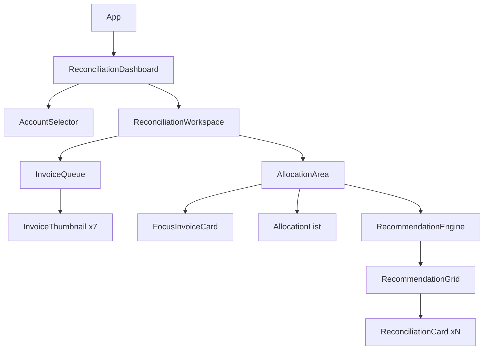

# Architecture Spec — Item-Aware Manual Reconciliation (LSR-5)

## 1. Component Hierarchy
The UI will be organized into a dedicated `reconciliation` feature folder.

## 2. Core Logic (The Scoring Engine)
The `AllocationEngine` will be implemented as a specialized hook (`useAllocationEngine`) that performs the following:

1.  **Normalization:** Converts raw `transaction_headers` and `transaction_items` into `NormalizedDocument` types.
2.  **Signature Generation:** Computes SKU-based bucket signatures (e.g., `LPG:120|CYL:5`).
3.  **Scoring:** Executes the weighted matrix against all eligible cards for the focus invoice.
4.  **Balance Management:** Tracks `available_balance` and `remaining_to_allocate` in a local state before persisting drafts.

### 2.1 Scoring Weight Storage (ARCH-1)
*   **Primary:** Supabase `app_config` table (Key: `RECON_SCORING_WEIGHTS`).
*   **Fallback:** Hardcoded constant in `src/features/reconciliation/constants.ts` (used if DB fetch fails).

### 2.2 SKU-to-Bucket Mapping (ARCH-2)
Scoring signatures use the following authoritative buckets:
| ERP SKU Pattern | Business Bucket | Logical Group |
|---|---|---|
| `*.1` (e.g., 9.1, 14.1) | `CYL_DEPOSIT` | Shell |
| `*.4` or `*01` (e.g., 9.4, 901) | `LPG_CONTENT` | Gas |
| `*ACC` | `ACCESSORIES` | Other |

## 3. Data Flow & Persistence

### 3.1 Draft Saving
*   **Auto-save:** Triggered every 30 seconds or after any successful allocation event.
*   **Storage:** Persisted to `reconciliation_session` table in Supabase (JSONB payload for speed).

### 3.2 Authoritative Writes
*   **Finalization:** When the user clicks "Finalize Account", the engine performs a batch write:
    *   Creates `allocation` records.
    *   Creates `allocation_item_impact` audit rows.
    *   Creates `training_record` entries (for any overrides > 80% score).
    *   Updates `available_balance` on `transaction_headers` (using row-level locking).
    *   Updates `unmatched_credit` pool.

## 4. UI/UX Specifications

### 4.1 The 3+1+3 Queue
*   A horizontal ribbon of invoice thumbnails.
*   The center thumbnail is the "Focus" invoice.
*   Thumbnails show: `DOCNO`, `Date`, and a `ProgressRing` (showing allocation %).

### 4.2 Drag-and-Drop Implementation
*   **Library:** `dnd-kit` (or native React DnD).
*   **Source:** Any card in the `RecommendationGrid`.
*   **Target:** Any thumbnail in the `InvoiceQueue`.
*   **Effect:** Opens a quick-allocation modal (defaulting to the recommended amount) or performs a full allocation if the match is exact.

### 4.3 Warning Badge Logic (ARCH-4)
Cards display semantic badges based on recommendation confidence and document health:
- **Blue (Info):** Amount match only (no SKU data available).
- **Yellow (Suggestion):** Item overlap match with score between 40-79%.
- **Orange (Warning):** Weak match (< 40%) or VAT consistency failure detected.

## 5. Security & Invariants
*   **INV-9 (Feedback):** The `AllocationArea` must block the "Finalize" button if any manual matches exist without a recorded "Reason".
*   **Role-Based Access:** Only `Finance Manager` or `Debtors Clerk` can access this workspace.
