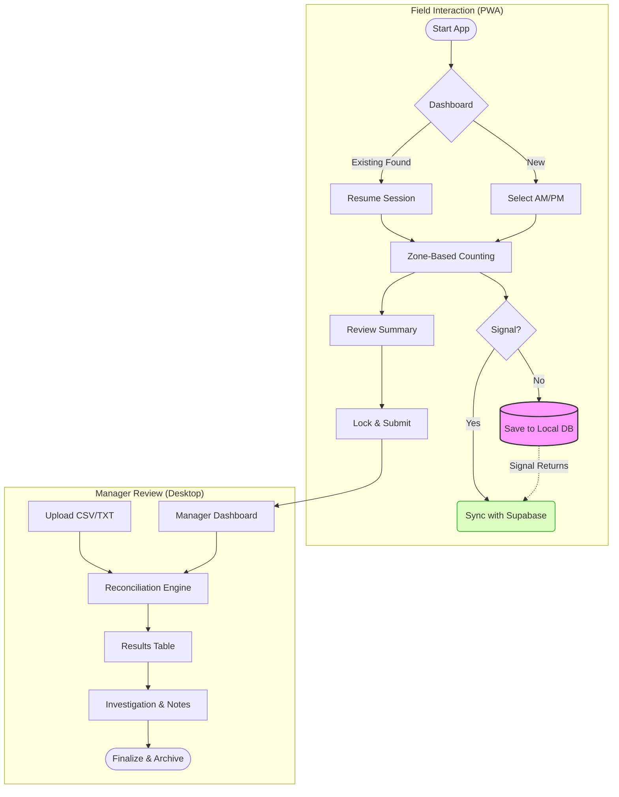

# 🗺️ LPG Stock Recon: User Flow & Robustness Guide

This document maps out the end-to-end user experience, including how the application handles offline scenarios and connectivity interruptions.

## 1. Role: Field Counter (Mobile PWA)
**Objective**: Accurately capture physical yard stock without manual math.

### Flow Steps:
1. **Initialize Session**: 
   - Open PWA --> Tap **"New Count"** --> Select **[AM]** or **[PM]**.
   - *Robustness*: App checks for existing in-progress sessions in local `Dexie` storage to prevent accidental duplicates.

2.  **The Counting Interface**:
    - **Physical Input**: Uses `[ - 0 + ]` controls or taps the value for a full numpad overlay.
    - **Navigation**: Tabs through cylinder sizes (9kg, 14kg, 19kg, SV, DV).
    - **Category Shift**: Taps "Next: Empties" to move from Gas Contents to generic Shells.

3.  **Review Summary**:
    - View aggregated totals by Brand and Size.
    - *Auto-Shell Logic*: The UI visually clarifies that Fulls counted will automatically contribute to the Shell reconciliation pool.

4.  **Submission**:
    - Tap **"Confirm & Submit"**.
    - *Offline Resilience*: If the yard has no signal, the session is marked as `completed` locally. The app will background-sync once it detects a heartbeat from the Supabase API.

### 🛠️ Edge Case: Mid-Count Interruption
| Event | System Response |
| :--- | :--- |
| **Browser Refresh** | `CountSession.tsx` loads the `sessionID` from the URL/State. Local state is hydrated from Dexie. **No data loss.** |
| **Battery Death** | Upon reboot/reopen, the "Dashboard" detects a "Pending Local Count". User is prompted to resume where they left off. |
| **Offline -> Online** | `useSync` hook monitors the navigator status. Triggers a `POST /rpc/sync_physical_counts` when signal returns. |

---

## 2. Role: Depot Manager (Analysis Dashboard)
**Objective**: Identify missing paperwork or physical shrink.

### Flow Steps:
1.  **Data Ingestion**:
    - **ERP SOH**: Uploads `STKCOUNT.csv` (System state).
    - **Movements**: Uploads `CURRENT.TXT` (Sales/GRV history).
2.  **Reconciliation Trigger**:
    - Manager selects the specific Physical Count session.
    - Engine runs the **Three-Tier Math**:
        - **Tier 1 (SOH)**: System vs Physical.
        - **Tier 2 (Movement)**: Expected vs Actual.
        - **Tier 3 (Timeline)**: Morning vs Afternoon Delta.
3.  **Audit & Resolve**:
    - Inspect rows tagged as **CRITICAL** (Red).
    - Verify against paper invoices not yet in ERP.
    - Add **Investigation Notes** and click **"Finalize Report"**.

---

## 🚀 Technical Flow Diagram

